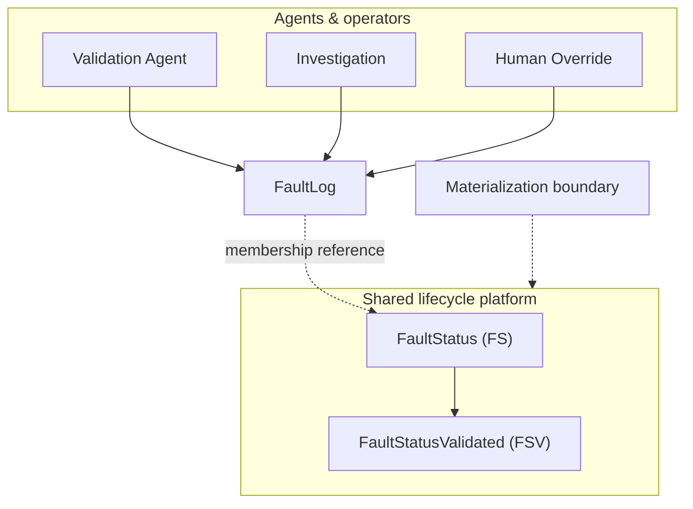
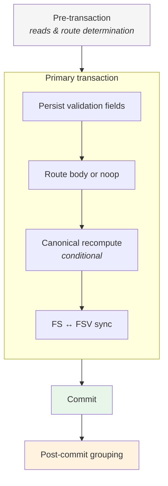

[README.md](https://github.com/user-attachments/files/29105086/README.md)
# Agent-Driven Fault Lifecycle

Architecture documentation for a shared lifecycle platform that coordinates validation, operational correction, aggregation, and grouping of renewable-energy fault events.

## Start Here

If you're new to the repository:

1. Read this README
2. Read [Validation Agent](docs/validation-agent.md)
3. Read [Lifecycle Platform](docs/lifecycle-platform.md)
4. Read [Transaction Model](docs/transaction-model.md)
5. Read [Design Principles](docs/design-principles.md)

## Key Architectural Ideas

- FaultLog is the source of truth
- FS and FSV are derived views
- Agents produce outcomes, not aggregate state
- Materialization is the only lifecycle entry point
- Canonical recomputation favors correctness over delta patching
- Grouping is eventually consistent

---

## How the system works

Solar plants produce continuous fault detections across hierarchical equipment. Those detections are noisy, overlapping, and numerous. Operators need to know which events are credible, how they roll up into plant-level operational state, and how related faults cluster into actionable groups.

Automated agents and human operators produce **outcomes** at the fault-log level. A **shared lifecycle platform** materializes those outcomes into durable aggregate state.

The data model has three layers:

- **FaultLog** — source of truth for individual detections and revisions (validation status, occurrences, loss, equipment identity, audit metadata)
- **FaultStatus (FS)** — platform-owned operational summary for a lifecycle
- **FaultStatusValidated (FSV)** — platform-owned validated summary, synchronized from FS and extended with grouping state

Logs link to lifecycles by membership reference. FS and FSV are derived views — always re-derivable from the current sibling log set.

**Producers** write log-level outcomes:

| Producer | Role |
|----------|------|
| Validation Agent | Classifies detections as valid, invalid, or inconclusive |
| Investigation | Applies operational corrections (occurrences, loss, dates, metadata) |
| Human override | Operator validation with attribution |

None of these producers own aggregate topology. Every path converges on the **shared lifecycle platform**, which routes, aggregates, synchronizes, and groups under uniform rules. Equivalent log fields and validation outcomes produce equivalent downstream state regardless of origin (**agent parity**).

**Materialization** is the per-log entry point. Given a log and an outcome, the platform persists validation fields, selects a route (create, join, convert in place, or noop), mutates FS/FSV, synchronizes the pair, and commits atomically. When validation status is unchanged but operational fields change, **canonical recomputation** re-derives aggregates from the full sibling log set inside the same transaction.

**Grouping** runs after commit. Related valid, active faults cluster under parent records to reduce alert noise. Grouping is eventual — per-lifecycle state is correct at commit; parent-child links may lag briefly and are retried on subsequent lifecycle events.

The platform is shaped by explicit ownership boundaries, transactional consistency at commit, deterministic recomputation, idempotent safe-retry primitives, and auditability for automated mutations.

---

## Ownership Model

Agents and operators own log-level outcomes. The platform owns aggregate lifecycle state.



| Owner | Domain |
|-------|--------|
| **Agents & operators** | FaultLog — validation fields, operational fields, audit metadata |
| **Platform** | FS — operational lifecycle aggregates |
| **Platform** | FSV — validation status, actionable, grouping links, feedback |

---

## Transaction Flow

Phases of a lifecycle mutation and the consistency guarantees at each boundary.



| Phase | Consistency |
|-------|-------------|
| **Pre-transaction** | Read-only preparation; route fixed before any write |
| **Primary transaction** | Log, FS, and FSV mutate atomically |
| **Commit** | Per-lifecycle state is durable and internally consistent |
| **Post-commit grouping** | Eventual; failures do not roll back committed mutation |

---

## Architecture documentation

| Document | Description |
|----------|-------------|
| [Validation Agent](docs/validation-agent.md) | Decision generation, validation workflow, ownership boundaries, and materialization handoff |
| [Lifecycle Platform](docs/lifecycle-platform.md) | Shared materialization platform — ownership, routing, scenarios, grouping semantics |
| [Transaction Model](docs/transaction-model.md) | How consistency is maintained — phases, routes, commit guarantees, failure semantics |
| [Design Principles](docs/design-principles.md) | Architectural rules — source of truth, materialization boundaries, idempotency, ownership |

---

## Repository layout

```text
README.md                   ← documentation hub (this file)
docs/
  validation-agent.md
  lifecycle-platform.md
  transaction-model.md
  design-principles.md
diagrams/
  system-overview.md
  materialization-flow.md
  transaction-flow.md
  ownership-model.md
```
