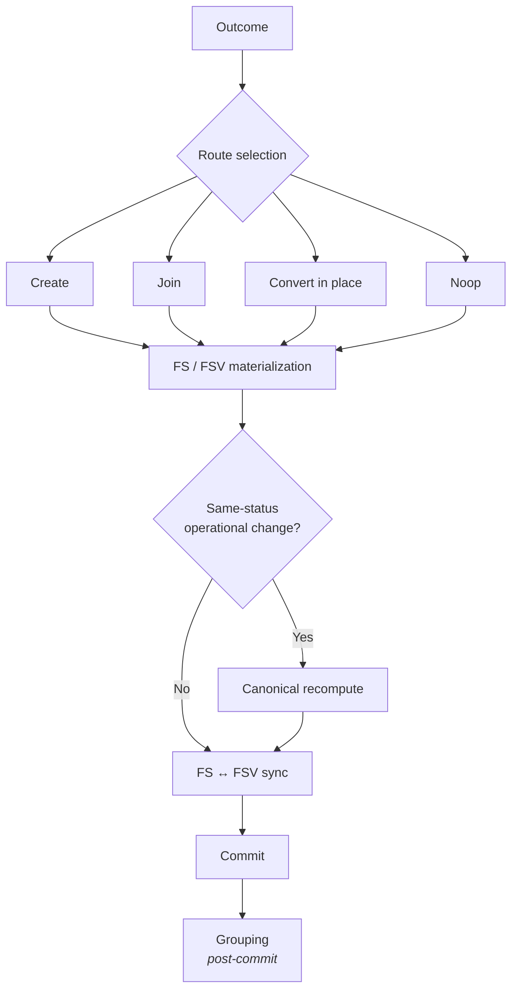

# Materialization Flow

Per-log path from agent-produced outcome to aggregate state and post-commit grouping.

## Route selection

Routing is driven by the proposed validation outcome and existing lifecycle topology — not by which producer invoked materialization.

| Route | Effect |
|-------|--------|
| **Create** | New FS and FSV; log joins new lifecycle |
| **Join** | Log moves to existing FS/FSV for same identity and status |
| **Convert in place** | FSV created or updated on current FS |
| **Noop** | Validation metadata persisted; aggregate work skipped |

When routing returns noop but operational log fields changed under unchanged validation status, canonical recomputation runs inside the transaction before FS ↔ FSV synchronization.

## Related documents

- [`docs/internal/lifecycle-platform.md`](../docs/internal/lifecycle-platform.md)
- [`docs/transaction-model.md`](../docs/transaction-model.md)
