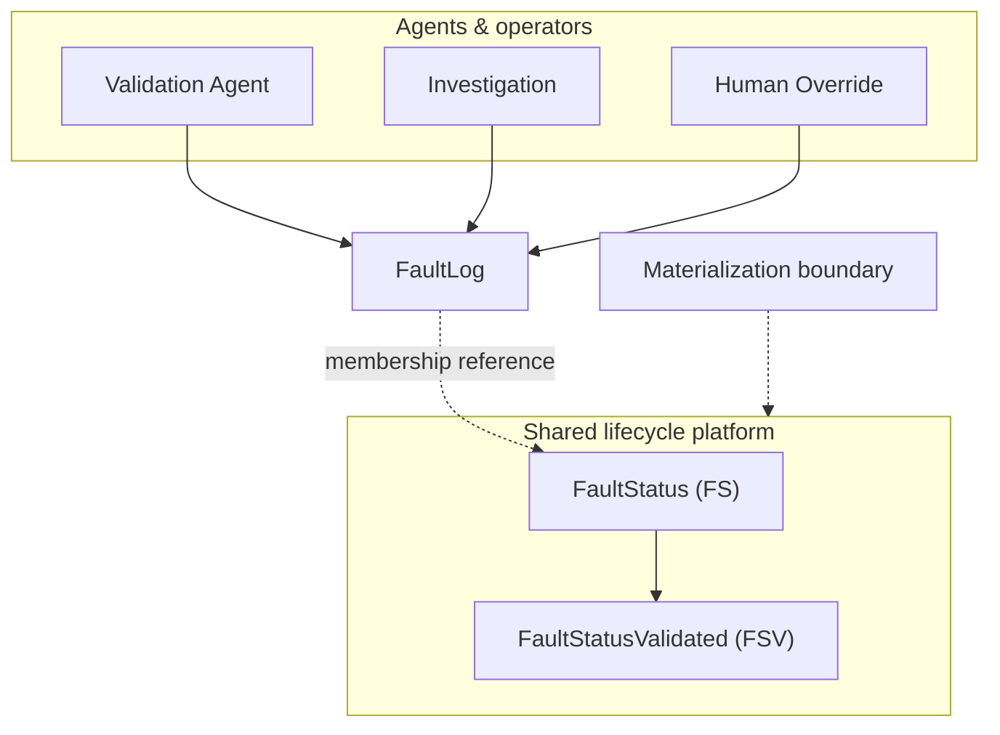

# Ownership Model

Who writes what — agents own log-level outcomes; the platform owns aggregate lifecycle state.

## Ownership summary

| Owner | Domain |
|-------|--------|
| **Agents & operators** | FaultLog — validation fields, operational fields, audit metadata |
| **Platform** | FS — operational lifecycle aggregates |
| **Platform** | FSV — validation status, actionable, grouping links, feedback |

Agents do not independently create, route, aggregate, synchronize, or group. The platform does not perform agent analysis or proposal generation.

Within aggregates, FS owns operational fields (dates, losses, hierarchy, resolution). FSV owns validation and grouping fields. Shared operational fields on FSV are synchronized from FS at commit.

## Related documents

- [`docs/design-principles.md`](../docs/design-principles.md)
- [`docs/internal/lifecycle-platform.md`](../docs/internal/lifecycle-platform.md)
