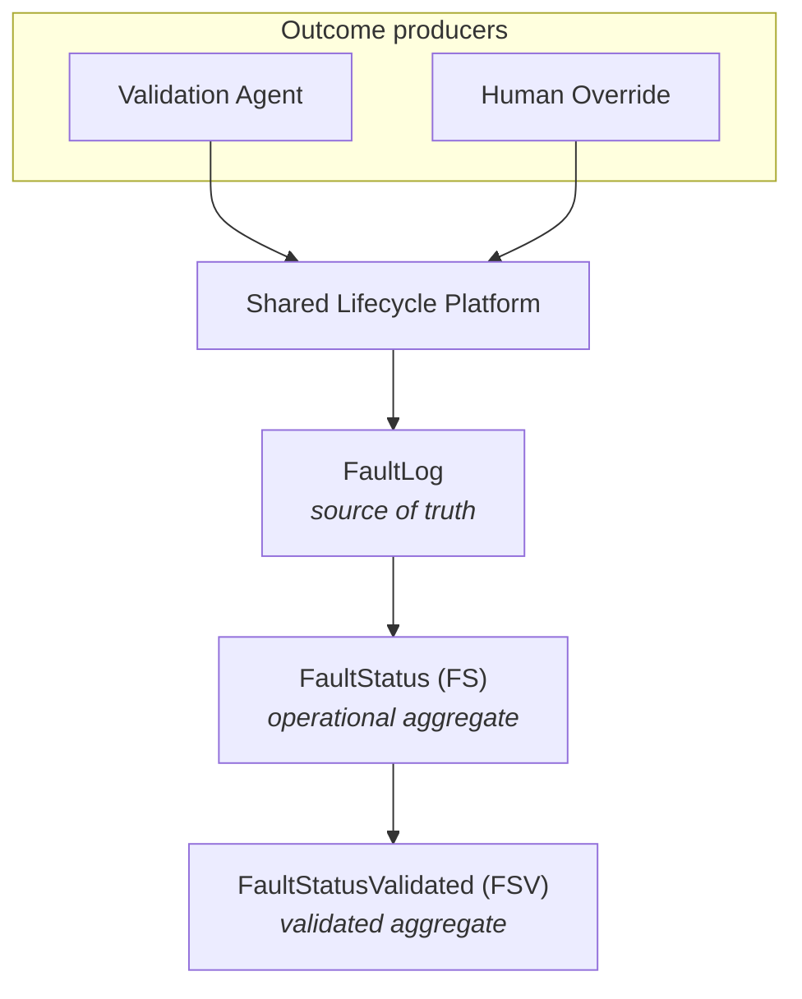

# System Overview

High-level view of how producers converge on the shared lifecycle platform and how aggregate state is derived.

## Reading the diagram

| Layer | Role |
|-------|------|
| **Outcome producers** | Assign validation outcomes at the log level; do not own aggregate topology |
| **Shared Lifecycle Platform** | Materialization, routing, aggregation, synchronization, grouping |
| **FaultLog** | Authoritative detection-level state; lifecycle membership by reference |
| **FS** | Derived operational summary for a lifecycle |
| **FSV** | Derived validated summary; mirrors FS for shared fields |

Investigation follows the same convergence pattern: operational corrections produce log-level mutations that hand off to the shared lifecycle platform before aggregate state is authoritative.

## Related documents

- [`docs/internal/lifecycle-platform.md`](../docs/internal/lifecycle-platform.md)
- [`docs/design-principles.md`](../docs/design-principles.md)
