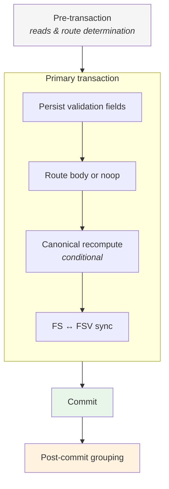

# Transaction Flow

Phases of a lifecycle mutation and the consistency guarantees at each boundary.

## Phase guarantees

| Phase | Consistency |
|-------|-------------|
| **Pre-transaction** | Read-only preparation; route fixed before any write |
| **Primary transaction** | Log, FS, and FSV mutate atomically |
| **Commit** | Per-lifecycle state is durable and internally consistent |
| **Post-commit grouping** | Eventual; failures do not roll back committed mutation |

## Related documents

- [`docs/transaction-model.md`](../docs/transaction-model.md)
- [`docs/design-principles.md`](../docs/design-principles.md)
